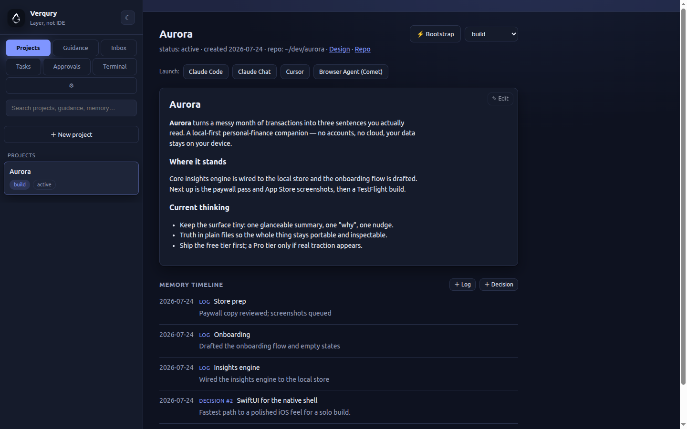
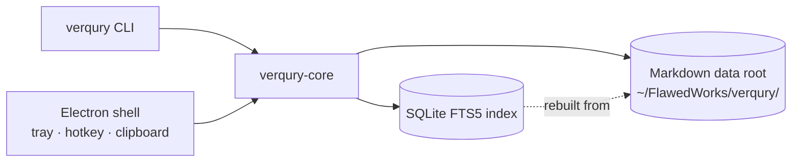

# Verqury

**Layer, not IDE.** Verqury is a low-friction Linux desktop companion for AI-assisted
product development. It doesn't replace the chat AIs, terminal agents, editors, or
browsers you already use — it organizes the process around them: durable project
memory, reusable guidance, captured artifacts, session bootstrapping, and task
routing, from first concept through build, release, and marketing.

- **Platform:** Linux x64 (X11) desktop — Node 20 + Electron shell, plain-JS renderer
- **Status:** **v0.6.3** (2026-08-07) — a **build-time meter** on every project, harvested from the session transcripts your AI CLI already leaves on disk, so it backfills real history instead of starting at zero ([ADR-0013](docs/adr/0013-session-metrics-harvested-from-transcripts.md)); plus a relay that fails fast instead of stalling nine minutes when the app isn't running, and a window that admits it's still in the tray. On the complete **remote decision relay** (approve by tap; long context by email), color-coded terminal tabs, and the v0.3.0 multi-tab terminal workbench. Packages as an AppImage + `.deb`. See [CHANGELOG](CHANGELOG.md).
- **Publisher:** [FlawedWorks](https://flawedworks.com)

> Verqury is a workflow layer, not an IDE — and deliberately not a chat interface,
> not a code editor, and not an agent orchestrator.



---

## What it does

A solo AI-assisted build moves constantly between surfaces: chat ideation, PRD and
architecture work, terminal coding agents, browser agents, external tools. Verqury is
the control layer around that motion:

1. **Project memory** — narrative, decisions, and stage tracking (concept → PRD →
   architecture → build → test → docs → release → marketing) as durable files.
2. **Guidance library** — skills, standards, and project instructions as first-class,
   composable markdown assets.
3. **Artifact inbox** — a global hotkey turns copied prompts, commands, snippets, and
   reports into searchable, reusable objects.
4. **Session bootstrapper** — assemble the right context packet for the right surface
   (chat, terminal agent, browser agent) in one action.
5. **Task router** — route tasks to direct execution, automation, browser agents, or
   human-in-the-loop, and feed completion reports back into project memory.

## Design principles

1. **Files are the database.** All durable data is markdown + YAML frontmatter on
   disk; SQLite is a deletable, rebuildable search index. Any terminal agent can read
   and write project memory natively — model-agnosticism by construction.
2. **Headless first.** Every feature works from the `verqury` CLI before it gets UI.
3. **Routing over integration.** AI surfaces are launch commands + handoff templates
   in config — adding a new tool never requires a code change.
4. **Quiet companion.** Always available, always organized, never in the way.

## Architecture



| Layer | Choice | Rationale |
|---|---|---|
| Durable data | Markdown + YAML frontmatter on disk | Agent-accessible, git-versionable, zero lock-in ([ADR-0001](docs/adr/0001-files-are-the-database.md)) |
| Search | SQLite FTS5, rebuildable | Fast search without owning truth ([ADR-0001](docs/adr/0001-files-are-the-database.md)) |
| Core logic | Plain Node library + CLI | Testable headless; agents can drive it ([ADR-0002](docs/adr/0002-core-library-plus-cli-electron-shell.md)) |
| Desktop shell | Electron | JS end-to-end; tray/hotkey/clipboard first-class ([ADR-0003](docs/adr/0003-electron-for-desktop-shell.md)) |
| AI surfaces | Config-defined launch/handoff adapters | Provider-churn insurance ([ADR-0004](docs/adr/0004-adapters-are-launch-handoff-config.md)) |
| Renderer | Vanilla JS, no framework | Lists, panes, forms — cut dependency surface ([ADR-0005](docs/adr/0005-vanilla-frontend.md)) |

### Project layout

```
verqury/
├── verqury-build-plan.md   # phased build plan (source of truth for scope)
├── PROGRESS.md            # phase checklist + session log
├── core/                  # verqury-core: data layer, index, CLI
├── app/                   # Electron shell (Phase 2+)
├── CHANGELOG.md
└── docs/
    ├── adr/
    └── engineering-notes.md
```

## Building

```bash
npm install
npm test          # runs workspace tests (node --test)
npm run lint
npm start -w app  # launch the Electron shell
```

### Packaging

Verqury packages as a Linux AppImage and `.deb` via electron-builder:

```bash
npm run dist -w app   # AppImage + .deb into app/dist/
npm run pack -w app   # unpacked dir (faster, for smoke-testing)
```

electron-builder rebuilds `better-sqlite3` for Electron's ABI at package time and
unpacks it from the asar; the packaged app runs the search CLI under Electron's own
embedded node ([ADR-0008](docs/adr/0008-packaged-search-uses-electron-node.md)), so no
system `node` is required at runtime. Because electron/electron-builder are hoisted in
the workspace, `electronVersion` is pinned in the build config. Run packaging on a
real Linux host (electron-builder fetches platform binaries a sandbox may block).

Built one phase per AI-agent session against [verqury-build-plan.md](verqury-build-plan.md);
`PROGRESS.md` records what shipped per session. Versioning is hand-set until packaging
(Phase 8). No signing keys, API keys, or tokens are stored in the repo.

## Privacy

Verqury is single-user and local-first: no accounts, no telemetry, no cloud sync. All
data lives in a user-owned directory of plain files.

## Documentation

- **[CHANGELOG.md](CHANGELOG.md)** — release history (Keep a Changelog + SemVer).
- **[docs/adr/](docs/adr/)** — Architecture Decision Records: the *why* behind the design.
- **[docs/engineering-notes.md](docs/engineering-notes.md)** — operational runbook (symptom → cause → fix).
- **[verqury-build-plan.md](verqury-build-plan.md)** — the phased build plan and data-layer spec.
- **`CLAUDE.md`** — the detailed engineering journal and working notes.

---

Source available under the [MIT License](LICENSE). © 2026 Gary Seiler / FlawedWorks.
"Verqury" and the Verqury logo are marks of Gary Seiler / FlawedWorks.
